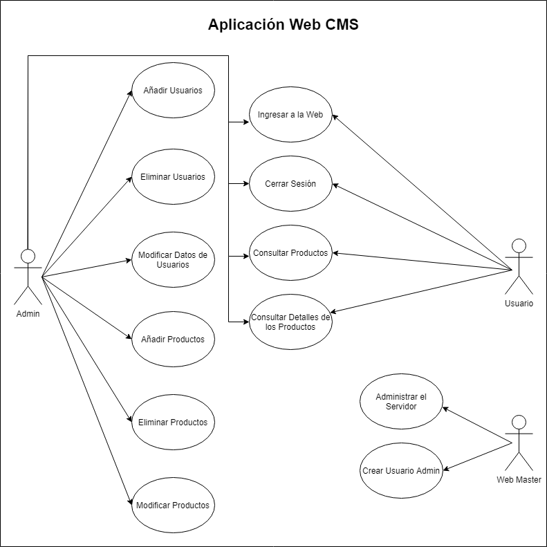
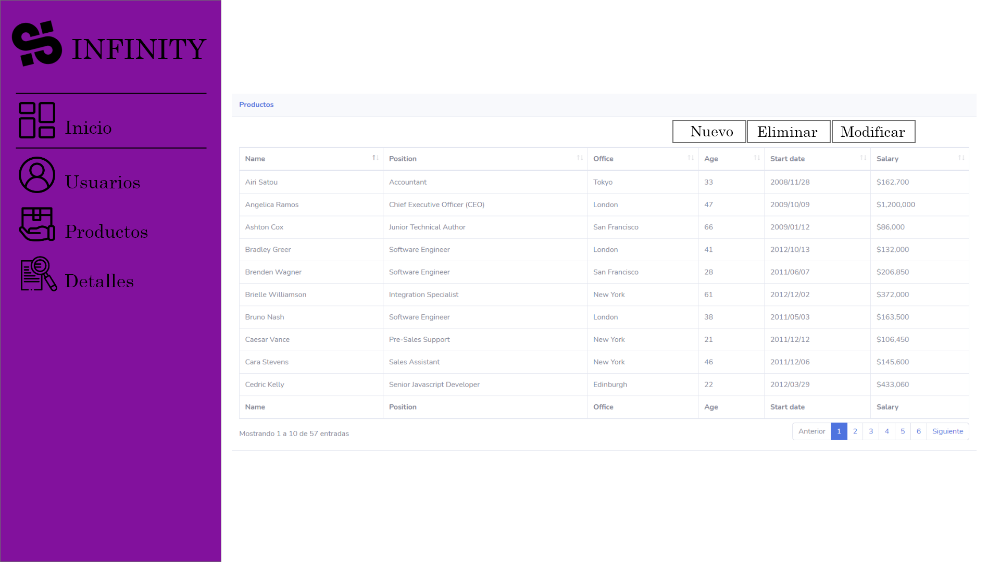
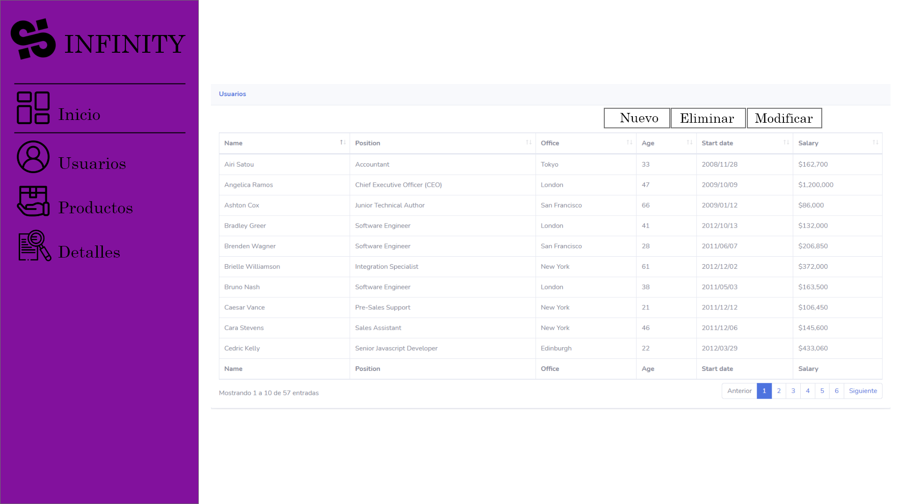

#### CICLO FORMATIVO DE GRADO SUPERIOR

### DESARROLLO DE APLICACIONES MULTIPLATAFORMA

##### ACCESO A DATOS - 2º CURSO

# [INFINITI CMS]

###### Curso: 2021/22

###### AUTOR: [Fouad Horri Ahcynat]

------

# Introducción

## Motivación y objetivos

La idea de hacer esta app es debida a que el año pasado en el primer curso de DAM hice una

página web del estilo de una tienda online y me gustó la idea de poder hacer algo parecido

pero para los dispositivos móviles, además he estado viendo videos de aplicaciones de

tiendas, y distintos diseños y me han llamado mucho la atención, por ello quiero hacer algo

parecido, así también podré aprender a usar mejor la herramienta de Android Studio para

futuros proyectos.

## Descripción de la aplicación

De manera general podríamos definir la aplicación como un catalogo donde se mostraran distintos productos, zapatillas, prendas de vestir (etc...),

En la aplicación se va a poder navegar por las distintas categorías de productos, se va a poder seleccionar un producto para poder ver los detalles de los productos, también tendremos opción de poder acceder a los mapas, para poder localizar las tiendas cercanas, donde podremos adquirir dichos productos, también contaremos con un chat por bluetooth para poder comunicarnos con nuestros amigos que tengan la aplicación instalada en sus dispositivos, la aplicación es amigable con un fácil uso para el usuario.

# Especificación de requisitos

## Requisitos funcionales CMS

- En cuanto a los requisitos funcionales, el CMS contara con un Dashboard, o pagina de inicio, donde se mostraran datos sobre el numero de accesos a la pagina web en las ultimas semanas del mes.

- La web CMS almacenara también el numero de productos disponibles en la base de datos, al igual que el numero de usuarios. 

- Contaremos con un control de acceso de usuarios, donde vamos a poder controlar el numero de usuarios existentes, también podremos ver que usuarios tienen acceso a la base de datos.

- En nuestro CMS tendremos un control de los productos, ya que podremos crear, modificar y eliminar productos de la base de datos. Podremos ver la información de los productos, en la tabla de productos.

- En nuestro CMS tendremos un control de los detalles de los productos, ya que podremos crear, modificar y eliminar los detalles de los productos, relacionados con los productos existentes en la tabla de productos.

  

- **DIAGRAMA DE CASOS DE USO**

  

  

  

## Wireframe

Incluye un boceto y la descripción de cada una de las pantallas de la aplicación

- En primer lugar contaremos con el DASHBOARD o índex de la página donde se mostraran distintos datos relacionados con el numero de usuarios, o ingresos a la página , en el último mes. 

- La vista de productos, donde se mostrara una tabla con los USUARIOSregistrados en la base de datos, también se mostraran los botones para poder Crear, Eliminar y Modificar un producto.

- En la vista de detalles productos, vamos a poder ver los DETALLES DE UN PRODUCTO, cuando pulsamos sobre un producto accederemos a esta vista que estará relacionada con la anterior.

  

## API REST

Describe los servicios, sus parámetros y el formato json de respuesta.

## Requisitos no funcionales

Describe todos los requisitos no funcionales que se deben tener en cuenta para el desarrollo de la aplicación (seguridad, conectividad, tipos de dispositivos, memoria, procesador, espacio de almacenamiento, etc.)

# Análisis Funcional

## Interfaz gráfico

Incluye las imágenes con el diseño de las pantallas y cualquier descripción o comentario que creas conveniente.

## Diagrama de clases

Se debe incluir un diagrama de clases, la descripción de las mismas.

## Diagrama E/R

Describe las tablas de la base de datos local e incluye un diagrama Entidad/Relación.

## Plan de pruebas

Define los casos de prueba que se deben realizar para comprobar el correcto funcionamiento de la aplicación web.

# Diseño Técnico

## Diagrama de paquetes y de componentes

Se debe incluir un diagrama de paquetes, de componentes, etc.

También se puede incluir la estructura y descripción de los ficheros que forman parte del proyecto. Descripción 

de algoritmos, etc.

## Arquitectura del sistema

Describir la arquitectura del sistema (diagrama de despliegue).

## Entorno de desarrollo, librerías y servicios

En este punto se explicarán las diferentes tecnologías utilizadas para la realización del proyecto, así como los elementos más importantes que permitan entender el funcionamiento del sistema.

## Instrucciones para la compilación, ejecución y despliegue de la aplicación

Describe los pasos a seguir para poder compilar el proyecto y ejecutarlo.

# Informe de pruebas

Describe el resultado de ejecutar los casos de prueba sobre la aplicación web y del API REST.

# Conclusiones

## Conocimientos adquiridos

Reflexiona sobre el trabajo realizado durante el desarrollo de la aplicación web y sobre los conocimientos adquiridos, problemas encontrados, etc.

## Mejoras futuras

Incluye aspectos y nueva funcionalidad que incluirías en el CMS en un futuro próximo. 